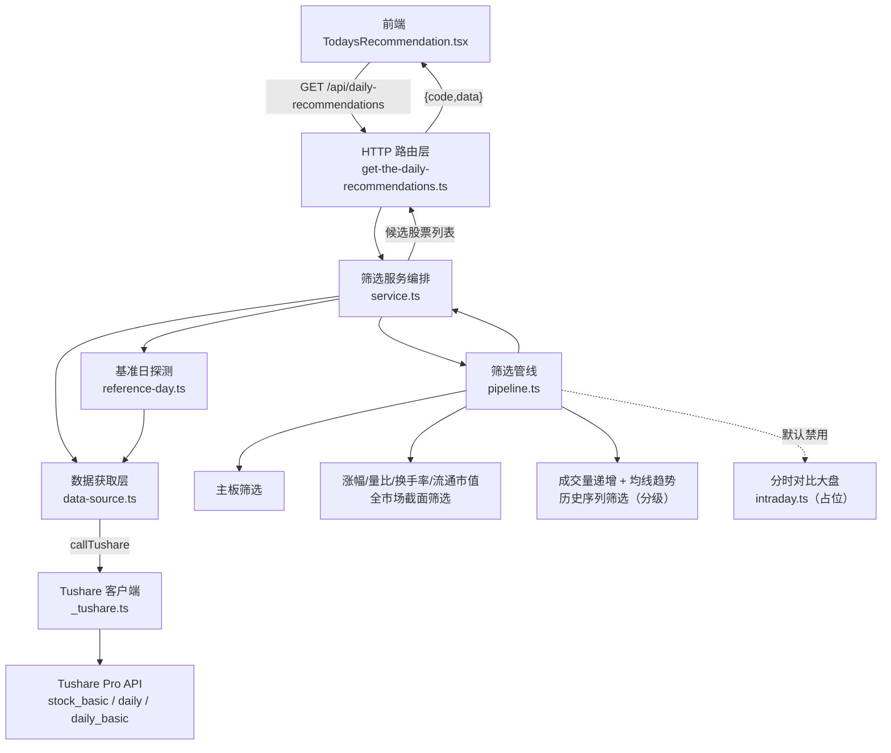
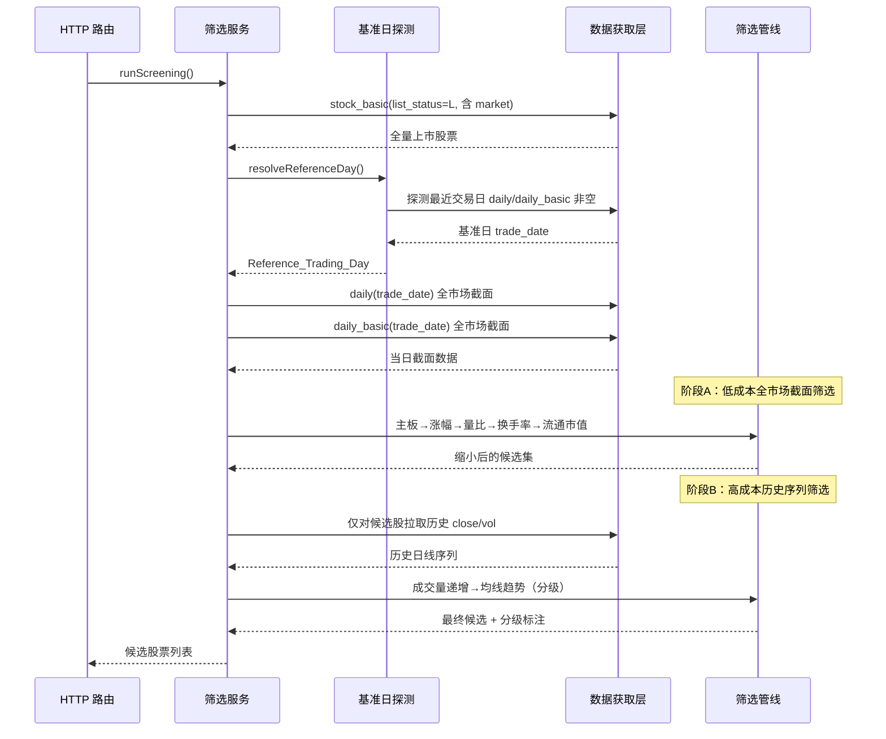

# 技术设计文档：每日多条件选股（daily-stock-screening）

## Overview

（概述）


本功能将现有占位实现 `src/apis/get-the-daily-recommendations.ts`（`GET /api/daily-recommendations`）升级为真正的多条件选股筛选服务，服务于"今日推荐"页面（`src/pages/TodaysRecommendation.tsx`）。

系统在交易日收盘后，基于 Tushare Pro 的当日与历史收盘数据，对沪深主板股票执行一组量价与均线筛选，输出候选股票列表，并沿用现有响应格式 `{ code, data }` 返回给前端。

设计目标与关键约束：

- **仅使用收盘后入库数据**：`daily`（15:00–16:00 入库）、`daily_basic`（15:00–17:00 入库）、`stock_basic`；**禁止**调用任何实时 `rt_*` 接口（需求 10.2、10.3）。
- **分钟权限未开通**：需求 8（分时对比大盘）依赖 `stk_mins`、`idx_mins`，当前版本不实现，设计为可插拔占位模块，默认禁用且不排除任何股票（需求 8.6）。
- **性能优先**：Tushare 调用有频次与耗时成本，筛选管线（pipeline）需以最少调用次数、最小历史数据拉取量完成，通过"先低成本全市场截面筛选、再高成本历史序列筛选"的顺序实现。
- **健壮性**：接口级失败（超时、权限不足、返回空）中止整体并返回错误；单股数据异常（缺字段、无效值）仅排除该股并记录，不中断整体（需求 4.4、5.4、6.5、9.5、10.4）。
- **可测试性**：筛选逻辑从 HTTP 路由中剥离为纯函数模块，便于 `bun test` 做单元测试与基于属性的测试（PBT）。

设计遵循项目既有约定：运行时 Bun、`Bun.serve` routes 对象式路由、统一经 `callTushare<T>()` 调用 Tushare、路由文件导出 `export const route`。

## Architecture

（架构）


### 分层结构

将筛选逻辑从 HTTP 路由中剥离，形成独立的可测试模块目录 `src/apis/screening/`。路由文件只负责编排调用与响应格式化。

```
src/apis/
├── get-the-daily-recommendations.ts   # HTTP 路由：编排 + 响应格式（{code,data} / {code:-1,message}+500）
├── _tushare.ts                          # 现有 Tushare 客户端（callTushare）
└── screening/
    ├── service.ts        # 筛选服务编排：确定基准日 → 拉数据 → 跑 pipeline → 组装结果
    ├── reference-day.ts  # 基准日（Reference_Trading_Day）探测
    ├── data-source.ts    # Tushare 数据获取封装（含 30s 超时、重试、权限不足识别）
    ├── ma.ts             # 移动平均线计算与"向上"判定工具
    ├── pipeline.ts       # 筛选管线：按顺序编排各 filter，短路缩小候选集
    ├── filters/
    │   ├── main-board.ts        # 需求 1：沪深主板 + 代码前缀
    │   ├── pct-chg.ts           # 需求 2：涨幅区间 [3,5]
    │   ├── volume-ratio.ts      # 需求 3：量比 ≥ 1
    │   ├── turnover-rate.ts     # 需求 4：换手率区间 [5,10]
    │   ├── circ-mv.ts           # 需求 5：流通市值区间 [500000,2000000] 万元
    │   ├── volume-increasing.ts # 需求 6：成交量递增（分级）
    │   ├── ma-trend.ts          # 需求 7：均线趋势（分级）
    │   └── intraday.ts          # 需求 8：分时对比（占位，默认禁用）
    └── types.ts          # 数据模型与类型定义
```

### 分层职责

- **HTTP 层**（`get-the-daily-recommendations.ts`）：调用 `runScreening()`，成功返回 `{ code: 0, data }`，失败捕获 `ScreeningError` 返回 `{ code: -1, message }` + HTTP 500。不包含任何业务逻辑。
- **服务编排层**（`service.ts`）：确定基准日、拉取数据、驱动 pipeline、组装候选股票输出。
- **数据获取层**（`data-source.ts`）：封装 `callTushare` 调用，负责超时（30s）、瞬时错误重试（≤3 次、间隔 ≥1s）、权限不足识别（不重试）、空结果判定。
- **筛选层**（`filters/` + `pipeline.ts` + `ma.ts`）：全部为纯函数，输入数据、输出保留/排除决策与分级标注，不产生 I/O，可独立单元测试与属性测试。

### 系统架构图



### 数据流（Data Flow）



## Components and Interfaces

（组件与接口）


### 1. HTTP 路由层

沿用现有 `export const route` 约定，替换内部逻辑：

```typescript
// get-the-daily-recommendations.ts
export const route = {
  "/api/daily-recommendations": {
    async GET(_req: Request) {
      try {
        const data = await runScreening();       // 返回 CandidateStock[]
        return Response.json({ code: 0, data });  // 需求 9.3、9.4（空列表也返回 code 0）
      } catch (err) {
        const message = err instanceof Error ? err.message : String(err);
        return Response.json({ code: -1, message }, { status: 500 }); // 需求 9.5
      }
    },
  },
};
```

### 2. 筛选服务编排（service.ts）

```typescript
async function runScreening(): Promise<CandidateStock[]>;
```

编排步骤：

1. 拉取 `stock_basic`（`list_status=L`，字段含 `ts_code,name,market`）；失败/空 → 抛 `ScreeningError`（需求 1.6）。
2. 调用 `resolveReferenceDay()` 确定基准日；无可用基准日 → 抛 `ScreeningError`（需求 1.7）。
3. 阶段 A：拉取基准日 `daily`、`daily_basic` 全市场截面，依次执行主板、涨幅、量比、换手率、流通市值筛选。
4. 阶段 B：仅对阶段 A 幸存候选股拉取历史序列，执行成交量递增、均线趋势筛选并生成分级标注。
5. （占位）阶段 C：`intraday` 默认禁用，直接透传候选集。
6. 组装 `CandidateStock[]` 返回。

### 3. 基准日探测（reference-day.ts）

```typescript
async function resolveReferenceDay(maxLookback?: number): Promise<string>; // 返回 YYYYMMDD
```

**策略**（需求 1.5、1.7）：

- 从当前自然日开始，若当前时间未过当日 15:00，则起始探测日回退到前一日。
- 逐个候选交易日探测：用轻量探针 `daily(trade_date=D)` 判断该日 `daily` 是否有非空数据；再用 `daily_basic(trade_date=D)` 判断是否非空。两者均非空即为基准日。
- 交易日推进使用 `trade_cal`（`exchange=SSE`，`is_open=1`）获取真实交易日历，避免把周末/节假日计入回溯计数；回溯上限为 **7 个交易日**。
- 回溯 7 个交易日仍无满足条件者 → 抛 `ScreeningError('无可用基准日')`。

> 权衡：`daily`/`daily_basic` 按 `trade_date` 探测一次即可复用为后续全市场截面数据，故探测与取数可合并，避免重复调用。

### 4. 数据获取层（data-source.ts）

封装所有 Tushare 调用，统一处理超时、重试、权限识别（需求 4.5、5.5、10.4、10.5、10.6）：

```typescript
// 带超时（默认 30s）、瞬时错误重试（≤3 次、间隔 ≥1s）、权限不足不重试
async function fetchWithPolicy<T>(
  apiName: string,
  params: Record<string, unknown>,
  fields: string,
  opts?: { timeoutMs?: number; maxRetries?: number }
): Promise<T[]>;

// 全市场截面（无 ts_code，仅按 trade_date）
async function fetchDailyByDate(tradeDate: string): Promise<DailyRow[]>;
async function fetchDailyBasicByDate(tradeDate: string): Promise<DailyBasicRow[]>;

// 候选股历史序列（用于均线与成交量递增）
async function fetchDailyHistory(tsCodes: string[], startDate: string, endDate: string): Promise<Map<string, DailyRow[]>>;
```

**错误分类**：

- **权限不足**：`callTushare` 抛出的错误消息中包含权限相关标识（如"权限"、"积分"、"没有接口访问权限"）→ 归类为 `PermissionError`，**不重试**，直接中止（需求 10.6）。
- **瞬时错误**：网络错误、超时、HTTP 5xx → 重试，最多 3 次，间隔 ≥1s（需求 10.5）。
- **超时**：使用 `AbortController` 对单次调用施加 30s（换手率场景 10s，见需求 4.5）超时。
- 重试耗尽或非瞬时错误 → 抛 `ScreeningError`，携带失败接口名与原因（需求 10.4）。

### 5. 均线计算工具（ma.ts）

```typescript
function sma(closes: number[], period: number, endIndex: number): number | null; // 简单移动平均
function isRising(today: number | null, prev: number | null): boolean;            // 需求 7.2 严格大于
```

### 6. 筛选管线（pipeline.ts）与各 filter

每个 filter 为纯函数，签名统一，输入候选与数据、输出决策：

```typescript
type FilterDecision =
  | { keep: true; grade?: GradeLabel }        // 保留，可携带分级标注
  | { keep: false; reason: string };          // 排除，携带原因（用于诊断记录）

interface Filter {
  name: string;
  apply(stock: WorkingCandidate, ctx: ScreeningContext): FilterDecision;
}
```

`pipeline.ts` 按既定顺序（见下节）串联执行，任一 filter 返回 `keep:false` 即短路排除该股并记录诊断。

### 7. 分时对比占位（intraday.ts，需求 8）

```typescript
const INTRADAY_ENABLED = false; // 分钟权限开通后置为 true

// 默认禁用：直接返回全部候选，不排除、不调用分钟接口（需求 8.6）
async function applyIntradayFilter(candidates: WorkingCandidate[], ctx: ScreeningContext): Promise<WorkingCandidate[]>;
```

**开通权限后的接入设计**（需求 8.1–8.5）：

- 沪市股票（`.SH`）对应上证指数 `000001.SH`，深市股票（`.SZ`）对应深证成指 `399001.SZ`。
- 通过 `stk_mins`（个股）与 `idx_mins`（指数）取相同分钟频率、相同交易时段（09:30–11:30、13:00–15:00）数据。
- 各自以当日开盘价为基准换算为涨跌幅百分比，仅对双方均有数据的对齐时间点比较。
- 占比 = 个股涨跌幅 ≥ 同刻大盘涨跌幅的对齐点数 / 有效对齐点总数；占比 ≥ 0.5 保留，否则排除。
- 有效对齐点为 0 或接口失败 → 不排除该股，记录提示（需求 8.6）。

模块以 `INTRADAY_ENABLED` 开关控制，且比较逻辑（换算、对齐、占比计算）拆为纯函数，便于在无权限时也能单元测试。

## 筛选管线顺序设计（Pipeline Ordering）

核心优化原则：**先用一次性全市场截面数据做低成本筛选，尽量缩小候选集；再对少量幸存候选执行需要历史序列（额外调用成本）的筛选**，以最小化历史数据拉取量。

| 顺序 | 筛选条件 | 需求 | 数据来源 | 成本 | 理由 |
|------|---------|------|---------|------|------|
| 1 | 主板 + 代码前缀 | R1 | `stock_basic`（1 次全量） | 极低 | 纯本地字符串判定，先剔除非主板，基数最大缩减 |
| 2 | 涨幅 [3,5] | R2 | `daily`（1 次全市场截面） | 低 | 截面字段直接判定，涨幅区间窄、过滤力强 |
| 3 | 量比 ≥ 1 | R3 | `daily_basic`（1 次全市场截面） | 低 | 截面字段直接判定 |
| 4 | 换手率 [5,10] | R4 | `daily_basic`（复用） | 低 | 复用同一截面，无额外调用 |
| 5 | 流通市值 [500000,2000000] | R5 | `daily_basic`（复用） | 低 | 复用同一截面，无额外调用 |
| 6 | 成交量递增（分级） | R6 | `daily` 历史（仅候选股） | 高 | 需近 3 日序列，仅对幸存候选拉取 |
| 7 | 均线趋势（分级） | R7 | `daily` 历史（复用/延伸） | 最高 | 需 ≥61 日 close，与步骤 6 历史数据复用 |
| 8 | 分时对比大盘 | R8 | `stk_mins`/`idx_mins` | 极高 | 当前禁用，占位 |

**短路理由**：步骤 1–5 只需 3 次接口调用（`stock_basic` 1 次 + `daily`/`daily_basic` 各 1 次全市场截面），即可把数千只股票缩小到通常几十只以内。步骤 6–7 才对这少量候选拉取历史序列，把历史日线的调用量从"全市场数千只"降为"候选数十只"，显著降低成本。

**历史数据获取方案与权衡**（需求 6、7 关键）：

- 需求 7 要求每只候选股约 **61 个交易日以上**的历史 `close`（计算基准日与前一日的 MA60 需 60+1=61，加上安全冗余取近 **90 个自然日区间**回溯，保证覆盖 61+ 交易日）。需求 6 的近 3 日 `vol` 可从同一历史序列复用。
- **方案 A（推荐）——按候选股逐个/分批拉取历史**：对阶段 A 幸存的候选股（数十只），调用 `daily(ts_code=X, start_date, end_date)` 取其历史序列。候选数量小，调用次数可控（数十次，可分批并发但需控制频率）。优点：拉取量与候选数成正比，最小化数据量；缺点：候选较多时调用次数偏多。
- **方案 B——按日期拉取近 ~90 个交易日全市场 `daily`，本地按 `ts_code` 聚合**：每个交易日 1 次调用 × ~90 天 ≈ 90 次调用，得到全市场历史后本地按股票分组。优点：调用次数固定（与候选数无关）；缺点：拉取全市场数据量巨大（数千股 × 90 日），内存与传输成本高，且大部分数据在阶段 A 已被淘汰、属浪费。
- **推荐**：采用**方案 A**。因为阶段 A 已将候选缩小到几十只，方案 A 的调用次数（数十次）通常小于方案 B 的固定 ~90 次，且数据量小一个数量级。实现上对候选股按批（如每批 5–10 只）串行拉取，批间留间隔以规避频控。仅当阶段 A 幸存候选数异常大（如 > 90）时，可回退方案 B。

## 分级标注设计（Grade Labeling）

需求 6（成交量）与需求 7（均线）均要求区分"理想条件"与"放宽条件"，且两级**互斥**（不可同时标注）。设计如下：

- 使用字面量联合类型 `GradeLabel = "理想条件" | "放宽条件"` 表达单项分级。
- 候选股结构中分别持有 `volumeGrade: GradeLabel` 与 `maGrade: GradeLabel`，二者各自独立。
- filter 内部先判严格（理想）分支，命中即赋"理想条件"并**不再**进入放宽分支；否则判放宽分支。互斥性由控制流保证（if / else if），从结构上杜绝双标。
- 响应中直接回传这两个字段（需求 9.2）。

## Data Models

（数据模型）


```typescript
// ===== Tushare 原始行（data-source 层） =====

// stock_basic 行（含板块判定所需 market）
interface StockBasicRow {
  ts_code: string;   // 如 "600000.SH"
  name: string;
  market: string;    // 板块，如 "主板"/"创业板"/"科创板"/"北交所"
}

// daily 行（当日截面或历史）
interface DailyRow {
  ts_code: string;
  trade_date: string; // YYYYMMDD
  close: number;
  pct_chg: number;    // 百分比，如 3.5
  vol: number;        // 成交量（手）
}

// daily_basic 行
interface DailyBasicRow {
  ts_code: string;
  trade_date: string;
  volume_ratio: number; // 量比（>0）
  turnover_rate: number; // 换手率（0–100，%）
  circ_mv: number;       // 流通市值（万元）
}

// ===== 领域模型 =====

type GradeLabel = "理想条件" | "放宽条件";

// pipeline 内部流转的工作态候选（可携带尚未定型的分级）
interface WorkingCandidate {
  ts_code: string;
  name: string;
  daily?: DailyRow;               // 基准日截面
  dailyBasic?: DailyBasicRow;     // 基准日截面
  history?: DailyRow[];           // 升序历史序列（阶段 B 填充）
  volumeGrade?: GradeLabel;       // 需求 6 分级
  maGrade?: GradeLabel;           // 需求 7 分级
}

// 接口最终返回的候选股票（需求 9.2）
interface CandidateStock {
  ts_code: string;        // 股票代码
  name: string;           // 名称
  volumeGrade: GradeLabel; // 成交量分级："理想条件" | "放宽条件"
  maGrade: GradeLabel;     // 均线分级："理想条件" | "放宽条件"
}

// 接口响应
interface RecommendationResponse {
  code: 0 | -1;
  data?: CandidateStock[];  // 成功时；长度 0..主板股票总数
  message?: string;         // 失败时
}

// 筛选上下文
interface ScreeningContext {
  referenceDay: string;   // 基准日 YYYYMMDD
  intradayEnabled: boolean;
}

// 诊断/排除记录（用于需求 4.4/5.4/6.5 的可查询记录）
interface ExclusionRecord {
  ts_code: string;
  filter: string;   // 触发排除的筛选名
  reason: string;   // 排除原因（缺字段、无效值、数据不足等）
}

// 错误类型
class ScreeningError extends Error {
  constructor(message: string, readonly apiName?: string, readonly kind?: "permission" | "timeout" | "empty" | "no-reference-day" | "generic") {
    super(message);
  }
}
```

## Correctness Properties

（正确性属性）


*属性（property）是指在系统所有合法执行下都应成立的特征或行为——本质上是对系统"应当做什么"的形式化陈述。属性是人类可读的规格说明与机器可验证的正确性保证之间的桥梁。*

下列属性均为可用基于属性的测试（PBT）验证的普遍性陈述，覆盖筛选中的纯逻辑部分（区间判定、分级互斥、排除优先级、递增/均线判定、MA 计算、输出结构）。接口调用、重试时序、超时、权限识别等外部/时序行为不适合 PBT，改由集成测试与示例测试覆盖（见测试策略）。

### Property 1: 主板筛选与排除优先级

*对任意* 股票集合（`market` 与 `ts_code` 前缀随机），主板筛选后的结果满足：每只保留股票的 `market` 严格等于"主板"且代码前缀属于白名单 {600,601,603,605,000,001,002}；且任何代码前缀属于创业板(300/301)、科创板(688/689)、北交所(8/4) 的股票一定不在结果中（排除规则对保留规则具有绝对优先级）。

**Validates: Requirements 1.2, 1.3, 1.4**

### Property 2: 基准日回溯正确性

*对任意* "每个交易日 daily/daily_basic 是否非空"的可用性序列，`resolveReferenceDay` 选出的基准日是从起始日回溯范围内第一个 daily 与 daily_basic 均非空的交易日，且回溯不超过 7 个交易日；若 7 个交易日内无满足者则抛出"无可用基准日"错误。

**Validates: Requirements 1.5, 1.7**

### Property 3: 涨幅区间筛选（含端点 3、5）

*对任意* 有效数值 `pct_chg`，涨幅筛选保留该股当且仅当 3 ≤ pct_chg ≤ 5（含端点）；区间外一律排除。

**Validates: Requirements 2.2, 2.3**

### Property 4: 量比阈值筛选（含端点 1）

*对任意* 有效数值 `volume_ratio`，量比筛选保留该股当且仅当 volume_ratio ≥ 1（含端点 1）；小于 1 一律排除。

**Validates: Requirements 3.2, 3.3**

### Property 5: 换手率区间筛选（含端点 5、10）

*对任意* 有效数值 `turnover_rate`，换手率筛选保留该股当且仅当 5 ≤ turnover_rate ≤ 10（含端点）；区间外一律排除。

**Validates: Requirements 4.2, 4.3**

### Property 6: 流通市值区间筛选（含端点 500000、2000000）

*对任意* 有效数值 `circ_mv`（万元），流通市值筛选保留该股当且仅当 500000 ≤ circ_mv ≤ 2000000（含两端端点）；区间外一律排除。

**Validates: Requirements 5.2, 5.3**

### Property 7: 无效字段值一律排除并记录

*对任意* 筛选字段（`pct_chg`/`volume_ratio`/`turnover_rate`/`circ_mv`）取无效值（缺失、null、undefined、NaN、空串或非有效数值）的股票，对应筛选一律将其排除，并生成一条含股票代码与原因的排除记录；即使记录操作失败，排除仍然发生。

**Validates: Requirements 2.4, 3.4, 4.4, 5.4**

### Property 8: 成交量递增分级判定与互斥

*对任意* 最近三日成交量三元组 (vol1, vol2, vol3)：若 vol1 < vol2 < vol3 则保留并仅标"理想条件"（不标放宽）；若 vol1 ≤ vol2 ≤ vol3 但非严格递增则保留并仅标"放宽条件"（不标理想）；否则排除。任一保留股绝不同时具有"理想条件"与"放宽条件"两个成交量标注。

**Validates: Requirements 6.2, 6.3, 6.4**

### Property 9: 成交量数据不足或非法一律排除

*对任意* 最近成交量序列，若不足三条、或其中存在缺失/≤0 的值，则该股一律被排除并生成可查询排除记录；即使记录操作失败，排除仍然发生。

**Validates: Requirements 6.5**

### Property 10: 移动平均线计算正确性

*对任意* 长度足够的 `close` 序列与窗口 N，`sma` 计算结果等于对应窗口内 N 个收盘价的朴素算术平均（模型对照）。

**Validates: Requirements 7.1**

### Property 11: 均线向上判定（严格大于，含相等边界）

*对任意* 一对均线值 (today, prev)，`isRising` 为真当且仅当 today > prev；当 today == prev 或 today < prev 时判定为不向上。

**Validates: Requirements 7.2**

### Property 12: 均线趋势分级判定、互斥与数据长度分支

*对任意* `close` 序列：当长度 ≥ 61 且满足 MA5 > MA10 > MA20 > MA60 且四线均向上时，仅标"理想条件"（不标放宽）；当不满足多头排列但 MA5 向上且 MA10 向上时标"放宽条件"（不标理想）；当 MA5 或 MA10 不向上时排除；当长度 < 61 时跳过多头判定、结果绝不为"理想条件"；当长度 < 11 时一律排除并标注数据不足。任一保留股绝不同时具有两个均线标注。

**Validates: Requirements 7.3, 7.4, 7.5, 7.6, 7.7**

### Property 13: 候选输出结构完整性

*对任意* 通过全部筛选的 `WorkingCandidate`，组装出的 `CandidateStock` 必然包含 `ts_code`、`name`、`volumeGrade`、`maGrade` 四个字段，且 `volumeGrade` 与 `maGrade` 取值均属于 {"理想条件","放宽条件"}。

**Validates: Requirements 9.2**

### Property 14: 空结果不视为错误

*对任意* 输入数据（含使所有股票均被过滤的情形），只要筛选流程未发生接口级错误，成功路径返回的 `code` 恒为 0 且 `data` 恒为数组（长度可为 0，范围 0..主板股票总数），不返回错误。

**Validates: Requirements 9.3, 9.4**

## Error Handling

（错误处理）


错误分为两类，处理策略不同：

### 接口级失败（中止整体）

触发条件与响应见下表；均由数据获取层识别，向上抛出 `ScreeningError`，最终由 HTTP 层转为 `{ code: -1, message }` + HTTP 500，**不返回任何部分筛选结果**（需求 9.5、10.4）。

| 场景 | 触发需求 | 处理 |
|------|---------|------|
| `stock_basic` 失败/超时/空列表 | 1.6 | 中止，返回"股票列表获取失败" |
| 无可用基准日（回溯 7 交易日仍无） | 1.7 | 中止，返回"无可用基准日" |
| `daily_basic`（换手率）失败/10s 超时，重试 3 次均失败 | 4.5 | 中止本步、保留调用前候选集不变、返回"换手率数据获取失败" |
| `daily_basic`（流通市值）失败/30s 超时 | 5.5 | 中止本步、保留调用前候选集不变、返回"流通市值数据获取失败" |
| 任意接口错误或单次调用 30s 超时 | 10.4 | 中止、不返回部分结果、错误含失败接口名与原因 |
| 账号权限不足 | 10.6 | **不重试**、中止、返回含接口名的权限不足错误 |

### 重试与超时策略（需求 10.5、10.6、4.5、5.5）

- **超时**：使用 `AbortController`，默认 30s；换手率场景 10s（需求 4.5）。超时归类为瞬时错误。
- **瞬时错误重试**：网络错误、超时、HTTP 5xx 最多重试 3 次，相邻重试间隔 **≥ 1 秒**（`await sleep(1000)`）。
- **权限不足不重试**：`callTushare` 抛出的错误消息含权限/积分类标识时，归类为 `PermissionError`，立即中止，重试次数为 0（需求 10.6）。
- 重试耗尽后抛出 `ScreeningError`，`apiName` 字段携带失败接口名。

### 单股数据异常（仅排除该股，不中断整体）

- 缺字段、空/null/NaN/非有效数值、成交量不足 3 条或 ≤0、历史 close < 11 日等，仅将该股从候选集排除，并写入 `ExclusionRecord`（诊断记录）。
- 记录操作本身失败**不影响**排除动作（需求 2.4、4.4、5.4、6.5 中的"即使记录失败仍排除"）。
- 单股异常绝不导致整体筛选中止。

## Testing Strategy

（测试策略）


采用**双重测试**：单元/示例/集成测试覆盖具体场景与外部行为，基于属性的测试（PBT）覆盖纯逻辑的普遍正确性。项目当前无测试，将引入 Bun 内置测试运行器 `bun test`（测试文件命名 `*.test.ts`，与被测模块同目录，如 `src/apis/screening/filters/pct-chg.test.ts`）。

### 测试工具

- **测试运行器**：Bun 内置 `bun test`（单次执行，非 watch 模式）。
- **属性测试库**：采用 `fast-check`（TypeScript 生态成熟的 PBT 库），**不自行实现** PBT 框架。
- **Tushare mock**：对 `data-source.ts` / `callTushare` 注入 mock，隔离外部依赖以测试编排、重试、超时、错误分类。

### 属性测试要求

- 每条 Property 用 **单个** 基于属性的测试实现，最少 **100 次迭代**（`fc.assert(fc.property(...), { numRuns: 100 })`）。
- 每个属性测试以注释标注其对应设计属性，格式：
  `// Feature: daily-stock-screening, Property {number}: {property_text}`
- 生成器需专门覆盖边界：区间端点（3、5、10、500000、2000000、量比 1）、均线相等（isRising 边界）、历史长度边界（10/11/60/61 日）、成交量相等（非严格递增）、无效值（null/NaN/空串/≤0）。

### 属性测试映射

| Property | 被测模块 | 生成器要点 |
|----------|---------|-----------|
| P1 主板筛选与排除优先 | filters/main-board | 随机 market + 各板块前缀，含冲突边界 |
| P2 基准日回溯 | reference-day（mock 数据源） | 随机"每日可用性"布尔序列 |
| P3 涨幅区间 | filters/pct-chg | 随机浮点，覆盖 3、5 端点 |
| P4 量比阈值 | filters/volume-ratio | 随机浮点，覆盖 1 |
| P5 换手率区间 | filters/turnover-rate | 随机浮点，覆盖 5、10 |
| P6 流通市值区间 | filters/circ-mv | 随机数值，覆盖两端点 |
| P7 无效值排除 | 各截面 filter | 无效值集合 {null,undefined,NaN,"",非数值} |
| P8 成交量分级互斥 | filters/volume-increasing | 随机三元组，含相等 |
| P9 成交量数据不足/非法 | filters/volume-increasing | 长度 <3 或含 ≤0/缺失 |
| P10 MA 计算 | ma.sma | 随机 close 序列 + 窗口，模型对照朴素均值 |
| P11 isRising 判定 | ma.isRising | 随机 (today,prev)，含相等 |
| P12 均线分级/长度分支 | filters/ma-trend | 构造多头/非多头/长度 10/11/60/61 序列 |
| P13 输出结构完整性 | service 组装函数 | 随机 WorkingCandidate |
| P14 空结果不报错 | service（mock 数据源） | 使候选为空/非空的输入 |

### 单元 / 示例测试

覆盖 prework 中分类为 EXAMPLE / EDGE_CASE 的项：

- 需求 1.6：`stock_basic` reject / 超时 / 空数组三例 → 抛错。
- 需求 1.7：连续 7 交易日无数据 → 抛"无可用基准日"。
- 需求 7.7：历史 close < 11 日 → 排除并标数据不足。
- 需求 8.6：`INTRADAY_ENABLED=false` 时候选集原样透传、不调用分钟接口。
- 需求 9.5：`runScreening` 抛错 → HTTP 层返回 code -1、status 500、无 data。
- 需求 10.6：mock 权限错误 → 重试次数为 0、抛权限类 `ScreeningError`。

### 集成测试

覆盖 prework 中分类为 INTEGRATION / SMOKE 的项（1–3 个代表性示例，使用 mock 数据源，不做 100 次迭代）：

- 需求 1.1、9.1：端到端跑一次筛选，断言候选来自 pipeline、`stock_basic` 以 `list_status=L` 调用一次。
- 需求 4.5、5.5、10.4：mock 接口持续失败/超时，断言中止、候选集不变、错误含接口名。
- 需求 10.5：mock 瞬时失败，断言重试次数 ≤ 3、相邻间隔 ≥ 1s。
- 需求 10.1–10.3（SMOKE）：断言仅调用 `stock_basic`/`daily`/`daily_basic`，无任何 `rt_*` 调用。

## 关键算法与函数签名（低层设计）

### MA 计算（ma.ts）

```typescript
/** 计算以 endIndex 为窗口末端、长度 period 的简单移动平均；数据不足返回 null */
function sma(closes: number[], period: number, endIndex: number): number | null {
  if (endIndex + 1 < period || endIndex >= closes.length) return null;
  let sum = 0;
  for (let i = endIndex - period + 1; i <= endIndex; i++) sum += closes[i];
  return sum / period;
}

/** 均线向上：严格大于（相等或更小 → 不向上）——需求 7.2 */
function isRising(today: number | null, prev: number | null): boolean {
  return today != null && prev != null && today > prev;
}
```

### 成交量递增分级判定（filters/volume-increasing.ts）

```typescript
// 输入升序历史（末位为基准日），取最近 3 条 vol
function classifyVolume(recent: number[]): FilterDecision {
  if (recent.length < 3 || recent.some(v => v == null || !(v > 0)))
    return { keep: false, reason: "成交量数据不足或含非法值" };      // 需求 6.5
  const [v1, v2, v3] = recent.slice(-3);
  if (v1 < v2 && v2 < v3) return { keep: true, grade: "理想条件" };  // 需求 6.2 严格递增
  if (v1 <= v2 && v2 <= v3) return { keep: true, grade: "放宽条件" }; // 需求 6.3 非严格
  return { keep: false, reason: "成交量未递增" };                     // 需求 6.4
}
```

### 均线趋势分级判定（filters/ma-trend.ts）

```typescript
function classifyMaTrend(closes: number[]): FilterDecision {
  const n = closes.length;
  if (n < 11) return { keep: false, reason: "历史数据不足，无法评估" }; // 需求 7.7
  const end = n - 1, prev = n - 2;
  const rising = (p: number) => isRising(sma(closes, p, end), sma(closes, p, prev));
  const ma5Up = rising(5), ma10Up = rising(10);
  if (!ma5Up || !ma10Up) return { keep: false, reason: "MA5或MA10不向上" }; // 需求 7.5

  if (n >= 61) {                                                            // 需求 7.6 分支
    const ma5 = sma(closes, 5, end)!, ma10 = sma(closes, 10, end)!;
    const ma20 = sma(closes, 20, end)!, ma60 = sma(closes, 60, end)!;
    const bullishOrder = ma5 > ma10 && ma10 > ma20 && ma20 > ma60;
    const allUp = rising(20) && rising(60);
    if (bullishOrder && allUp) return { keep: true, grade: "理想条件" };    // 需求 7.3 多头
  }
  return { keep: true, grade: "放宽条件" };                                 // 需求 7.4 / 7.6
}
```

### 区间判定（各截面 filter 复用）

```typescript
function isValidNumber(x: unknown): x is number {
  return typeof x === "number" && Number.isFinite(x);
}
// 闭区间判定，含端点；无效值一律 false（→ 由调用方排除并记录）
function inClosedRange(x: unknown, lo: number, hi: number): boolean {
  return isValidNumber(x) && x >= lo && x <= hi;
}
```

### 基准日探测（reference-day.ts）

```typescript
async function resolveReferenceDay(maxLookback = 7): Promise<string> {
  // 1. 用 trade_cal 取最近交易日历（is_open=1），从"今日或前一日（未过15:00则前推）"起降序遍历
  // 2. 对每个候选交易日 D：探测 dailyByDate(D) 非空 且 dailyBasicByDate(D) 非空
  // 3. 命中即返回 D；累计探测交易日数达 maxLookback 仍未命中 → 抛 ScreeningError('no-reference-day')
}
```

### pipeline 编排（pipeline.ts / service.ts）

```typescript
async function runScreening(): Promise<CandidateStock[]> {
  const stocks = await fetchStockBasic();                 // 需求1.1；空/失败→抛错(1.6)
  const ref = await resolveReferenceDay();                // 需求1.5；无→抛错(1.7)
  const ctx: ScreeningContext = { referenceDay: ref, intradayEnabled: INTRADAY_ENABLED };

  // 阶段A：全市场截面，低成本短路
  let cands = stocks.filter(isMainBoard);                 // 需求1.2-1.4
  const daily = index(await fetchDailyByDate(ref), "ts_code");
  const basic = index(await fetchDailyBasicByDate(ref), "ts_code");
  cands = cands.filter(s => applyPctChg(daily.get(s.ts_code)))       // R2
              .filter(s => applyVolumeRatio(basic.get(s.ts_code)))    // R3
              .filter(s => applyTurnover(basic.get(s.ts_code)))       // R4
              .filter(s => applyCircMv(basic.get(s.ts_code)));        // R5

  // 阶段B：仅对幸存候选拉历史序列（方案A）
  const history = await fetchDailyHistory(cands.map(c => c.ts_code), startOf(ref, 90), ref);
  const result: CandidateStock[] = [];
  for (const s of cands) {
    const closes = (history.get(s.ts_code) ?? []).map(r => r.close);
    const vols   = (history.get(s.ts_code) ?? []).map(r => r.vol);
    const volDec = classifyVolume(vols);   if (!volDec.keep) { record(s, volDec); continue; }  // R6
    const maDec  = classifyMaTrend(closes); if (!maDec.keep) { record(s, maDec); continue; }    // R7
    result.push({ ts_code: s.ts_code, name: s.name, volumeGrade: volDec.grade!, maGrade: maDec.grade! });
  }

  // 阶段C：分时对比（当前禁用，不排除）——需求8
  return applyIntradayFilter(result, ctx);
}
```

## 设计决策与理由（汇总）

- **逻辑与 I/O 分离**：所有筛选判定为纯函数，是实现 PBT 的前提，也让重试/超时等副作用集中在数据获取层，边界清晰。
- **管线顺序（先截面后历史）**：把历史日线拉取量从"全市场"降到"数十只幸存候选"，是本设计最重要的性能决策。
- **历史数据方案 A（按候选拉取）优于方案 B（全市场按日）**：在阶段 A 有效缩小候选的前提下，方案 A 调用次数与数据量均更小；仅在候选异常多时回退方案 B。
- **分级互斥用控制流保证**：if/else if 结构从根本上杜绝同时标注理想与放宽，无需额外校验。
- **需求 8 占位可插拔**：以 `INTRADAY_ENABLED` 开关 + 纯比较函数隔离，权限开通后仅需置位并接入取数，不影响需求 1–7 流程。

