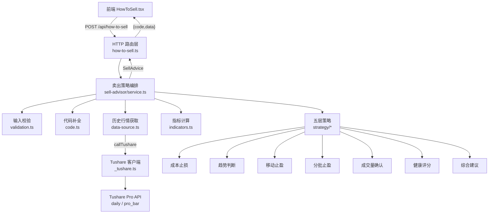
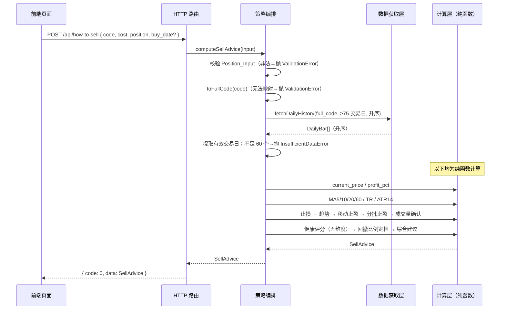

# 技术设计文档：我的股票合适卖（how-to-sell）

## Overview

（概述）

本功能（how-to-sell，"我的股票合适卖"）在路由 `/how-to-sell` 下为持仓用户提供一个**半自动止盈止损系统**。用户录入持仓信息（6 位股票代码、成本价、持仓数量、可选买入日期）后，系统基于 Tushare Pro 历史日线行情，分层计算成本止损、趋势判断、移动止盈、分批止盈、成交量确认，并汇总为一个 0–100 分的健康评分，最终给出结构化卖出建议，通过 antd `Table` 展示。

系统定位是"辅助决策"而非"简单报价"：分层给出保护本金、锁定利润、跟随趋势的完整策略。

设计目标与关键约束：

- **仅使用收盘后入库的历史日线**：`daily` / `pro_bar`；**禁止**调用任何实时 `rt_*` 接口（需求 2.7）。
- **复用现有约定**：统一经 `src/apis/_tushare.ts` 的 `callTushare<T>()` 调用 Tushare；数据获取、错误分类、重试/超时策略与纯函数分层，参考现有 `src/apis/screening/` 模块（`data-source` 取数 → 纯函数计算 → `service` 编排 → `types` 类型）。
- **逻辑与 I/O 分离**：全部指标计算、评分、决策为纯函数，是实现基于属性的测试（PBT）的前提，也让重试/超时等副作用集中在数据获取层。
- **健壮性**：输入非法 → HTTP 400；计算过程失败（历史数据不足、接口失败）→ HTTP 500，**不返回任何部分结果**（需求 11.5、11.6）。
- **技术栈一致**：后端 Bun + `Bun.serve` routes 对象式路由、路由文件导出 `export const route`；前端 React 19 + antd v6 + react-router-dom v7，与 `src/pages/TodaysRecommendation.tsx` 保持一致。

## Architecture

（架构）

### 分层结构

新增独立可测试模块目录 `src/apis/sell-advisor/`，HTTP 路由文件 `src/apis/how-to-sell.ts` 只做编排调用与响应格式化。前端新增页面 `src/pages/HowToSell.tsx` 并注册到 `App.tsx` 的 `/how-to-sell` 路由。

```
src/
├── apis/
│   ├── _tushare.ts                 # 现有 Tushare 客户端（callTushare）
│   ├── how-to-sell.ts              # HTTP 路由：POST /api/how-to-sell（编排 + 响应格式 400/500）
│   └── sell-advisor/
│       ├── service.ts              # 卖出策略编排：校验 → 取历史 → 各层计算 → 评分 → 建议 → 组装
│       ├── data-source.ts          # Tushare 历史行情获取封装（30s 超时、重试 ≤3 次、权限识别）
│       ├── code.ts                 # 6 位 code → full_code 后缀补全 + 校验（纯函数）
│       ├── validation.ts           # Position_Input 校验（纯函数）
│       ├── indicators.ts           # MA/TR/ATR/盈亏/最高价/量价变化等纯函数指标
│       ├── strategy/
│       │   ├── stop-loss.ts        # 第一层：成本止损（fixed / atr / stop_loss）
│       │   ├── trend.ts            # 第二层：趋势判断（MA 多头/转坏/中性）
│       │   ├── trailing-stop.ts    # 第三层：移动止盈（highest_price / trailing_stop）
│       │   ├── take-profit.ts      # 第四层：分批止盈目标
│       │   ├── volume-confirm.ts   # 第五层：成交量确认（量价背离 → 收紧回撤）
│       │   ├── health-score.ts     # 健康评分（五维度得分 + 合计）
│       │   └── suggestion.ts       # 综合建议决策（止损/止盈优先于评分档位）
│       └── types.ts                # 数据模型与类型定义（Position_Input / SellAdvice / 维度得分）
└── pages/
    └── HowToSell.tsx               # 前端页面：表单录入 + antd Table 展示
```

### 分层职责

- **HTTP 层**（`how-to-sell.ts`）：解析并校验请求体，调用 `computeSellAdvice()`。校验失败返回 `{ code: -1, message }` + HTTP 400；计算错误返回 `{ code: -1, message }` + HTTP 500；成功返回 `{ code: 0, data }` + HTTP 200。不含业务逻辑。
- **服务编排层**（`service.ts`）：串联校验、`full_code` 补全、历史行情获取、五层策略计算、评分与建议、结果组装。仅本层与 `data-source` 产生副作用。
- **数据获取层**（`data-source.ts`）：封装 `callTushare`，负责单次调用 30s 超时、瞬时错误重试（≤3 次、间隔 ≥1s）、权限不足识别（不重试）、空/不足判定。
- **计算层**（`code.ts`/`validation.ts`/`indicators.ts`/`strategy/*`）：全部纯函数，输入行情/参数、输出指标与决策，无 I/O，可独立单元测试与属性测试。

### 系统架构图



### 数据流（Data Flow）



### 计算顺序与依赖（关键）

各层存在数据依赖，编排顺序如下（此顺序在 `service.ts` 中固定）：

1. **盈亏**（需求 3）：由 `current_price`、`cost` 得 `profit_pct`。
2. **成本止损**（需求 4）：由 `cost` 与 ATR14 得 `fixed_stop_loss`、`atr_stop_loss`、`stop_loss`。
3. **趋势判断**（需求 5）：由 MA5/10/20/60 与 `current_price` 得趋势状态，可能触发"减仓 50%"。
4. **健康评分**（需求 9）：依赖趋势、`profit_pct`、成交量序列、资金、`stop_loss`（风险维度）。
5. **回撤比例定档**（需求 6.2、10.3、10.4）：由 `health_score` 档位得初始回撤比例（0.08 或 0.05）。
6. **成交量确认**（需求 8）：若量价背离，则在回撤比例基础上收紧 0.02（下限 0）。
7. **移动止盈**（需求 6）：由 `highest_price` 与最终回撤比例得 `trailing_stop`，判定是否触发。
8. **综合建议**（需求 10）：止损/移动止盈触发优先于评分档位，趋势转坏时下调。

> 说明：需求 6.2 的回撤比例依赖需求 9 的评分档位，故评分必须先于移动止盈线的最终计算；而成交量确认（需求 8.3）又在评分定档后收紧回撤比例，因此"评分 → 定档 → 成交量收紧 → 移动止盈线"的先后顺序是硬约束。

## Components and Interfaces

（组件与接口）

### 1. HTTP 路由层（how-to-sell.ts）

沿用 `export const route` 约定与 `{ code, data }` 响应格式。区别于 screening 使用 GET，本接口用 **POST** 接收持仓表单：

```typescript
// src/apis/how-to-sell.ts
import { computeSellAdvice } from "./sell-advisor/service";
import { ValidationError } from "./sell-advisor/types";

export const route = {
  "/api/how-to-sell": {
    async POST(req: Request) {
      let body: unknown;
      try {
        body = await req.json();
      } catch {
        return Response.json(
          { code: -1, message: "请求体不是合法 JSON" },
          { status: 400 }
        );
      }
      try {
        const data = await computeSellAdvice(body);
        return Response.json({ code: 0, data }); // 需求 11.1、11.2
      } catch (err) {
        // 输入非法 → 400（需求 11.5）；其余计算/接口错误 → 500（需求 11.6）
        const status = err instanceof ValidationError ? 400 : 500;
        const message = err instanceof Error ? err.message : String(err);
        return Response.json({ code: -1, message }, { status });
      }
    },
  },
};
```

路由需在 `src/index.ts` 中批量注入：`...howToSellRoute`。

### 2. 代码补全与校验（code.ts）

```typescript
/** 校验并将 6 位数字 code 补全为 full_code；无法映射沪深主板后缀时返回 null（需求 1.9、1.10） */
export function toFullCode(code: string): string | null;
// 规则：6 位纯数字；以 "6" 开头 → `${code}.SH`；以 "0" 开头 → `${code}.SZ`；其余 → null
```

放置于 `sell-advisor/code.ts`，为纯函数，供 `validation.ts` 与 `service.ts` 复用，也可被前端提交前的即时校验借鉴（前端可各自实现同规则或复用）。

### 3. 输入校验（validation.ts）

```typescript
/** 校验 Position_Input；通过返回规范化输入（含 full_code），否则抛 ValidationError（需求 1、11.5） */
export function validatePositionInput(raw: unknown): NormalizedInput;
```

校验规则（对应需求 1.3–1.6、1.10）：

- `code`：字符串且为 6 位纯数字，且 `toFullCode` 非 null。
- `cost`：数值，`0.01 ≤ cost ≤ 999999.99`，小数位 ≤ 2。
- `position`：整数，`1 ≤ position ≤ 9999999999`。
- `buy_date`（可选）：若提供，须为合法 `YYYYMMDD`，且 `19901219 ≤ buy_date ≤ 今日`。

### 4. 历史行情获取（data-source.ts）

参照 screening `data-source` 的 `fetchWithPolicy`（超时/重试/权限识别）风格：

```typescript
/** 单次调用 30s 超时、瞬时错误重试 ≤3 次且间隔 ≥1s、权限不足不重试（需求 2.6） */
export async function fetchWithPolicy<T>(
  apiName: string,
  params: Record<string, unknown>,
  fields: string,
  opts?: { timeoutMs?: number; maxRetries?: number }
): Promise<T[]>;

/**
 * 获取 full_code 截至最近交易日、按 trade_date 升序的历史日线（需求 2.1、2.2）。
 * 回溯自然日区间保证覆盖 ≥75 个交易日（如前推约 120 个自然日）。
 * 仅调用 daily / pro_bar，绝不调用 rt_* 接口（需求 2.7）。
 */
export async function fetchDailyHistory(fullCode: string): Promise<DailyBar[]>;
```

常量：`DEFAULT_TIMEOUT_MS = 30_000`、`DEFAULT_MAX_RETRIES = 3`、`RETRY_INTERVAL_MS = 1_000`、`LOOKBACK_DAYS = 120`（覆盖 75 交易日的安全冗余）。

### 5. 指标计算（indicators.ts）——纯函数

```typescript
/** 简单移动平均：窗口末端 endIndex、长度 period；数据不足返回 null（复用 screening/ma 思路） */
export function sma(closes: number[], period: number, endIndex: number): number | null;

/** 过滤有效交易日：open/high/low/close/vol 均非空且 close>0（需求 2.3） */
export function validBars(bars: DailyBar[]): DailyBar[];

/** 盈亏比例 (current-cost)/cost×100，四舍五入 2 位（需求 3.1） */
export function profitPct(currentPrice: number, cost: number): number;

/** 单日真实波幅 TR = max(high-low, |high-prevClose|, |low-prevClose|)（需求 4.2） */
export function trueRange(high: number, low: number, prevClose: number): number;

/** ATR14：最近 14 日 TR 的算术平均，保留 4 位；可用日不足 15 → null（需求 4.2、4.5） */
export function atr14(bars: DailyBar[]): number | null;

/** 持有期最高收盘价：提供 fromIndex 则取该索引至末尾的最高 close，否则取全区间（需求 6.1） */
export function highestClose(bars: DailyBar[], fromIndex?: number): number | null;

/** 变动百分比 (recent-prev)/prev×100（需求 8.1） */
export function changePct(recent: number, prev: number): number;

/** 四舍五入保留 n 位小数的工具 */
export function round(x: number, digits: number): number;
```

### 6. 五层策略模块（strategy/*）——纯函数

各模块输入已计算好的指标与有效交易日序列，输出对应结果片段，互不产生 I/O。

```typescript
// stop-loss.ts —— 需求 4
export function computeStopLoss(cost: number, atr: number | null, currentPrice: number): {
  fixed_stop_loss: number | null;
  atr_stop_loss: number | null;
  stop_loss: number | null;          // max(fixed, atr)；atr 不可用时取 fixed（需求 4.4、4.5）
  cost_stop_triggered: boolean;      // current_price ≤ stop_loss（需求 4.6）
};

// trend.ts —— 需求 5
export function computeTrend(ma: MASnapshot, currentPrice: number): {
  ma5: number; ma10: number; ma20: number; ma60: number;
  trend: "强势" | "转坏" | "中性" | "数据不足";
  reduce_half: boolean;              // 趋势转坏触发减仓 50%（需求 5.3）
};

// take-profit.ts —— 需求 7
export function computeTakeProfit(cost: number, currentPrice: number | null): TakeProfitTarget[];
// 两档：cost×1.20 / 30% / "盈利20%锁定利润"；cost×1.40 / 40% / "盈利40%继续减仓"；标注 reached

// health-score.ts —— 需求 9
export function computeHealthScore(inputs: ScoreInputs): {
  health_score: number;             // 0–100 整数
  dimensions: DimensionScore[];     // 五维度明细（名称 + 得分 + 可选备注）
};

// trailing-stop.ts —— 需求 6、8
export function computeTrailingStop(highestPrice: number | null, retreatRatio: number, currentPrice: number): {
  highest_price: number | null;
  trailing_stop: number | null;
  trailing_triggered: boolean;      // current_price ≤ trailing_stop（需求 6.5）
};

// volume-confirm.ts —— 需求 8
export function tightenRetreatRatio(baseRatio: number, bars: DailyBar[]): {
  retreat_ratio: number;            // 量价背离则 base-0.02，下限 0（需求 8.3）
  divergence: boolean;              // 是否判定量价背离（需求 8.2）
  volume_confirm_executed: boolean; // 数据不足 2 日 → false（需求 8.4）
};

// suggestion.ts —— 需求 10
export function decideSuggestion(ctx: SuggestionContext): "卖出" | "持有" | "继续观察" | "减仓";
// 优先级：止损/移动止盈触发→"卖出"；否则按 health_score 档位；趋势转坏下调"持有/继续观察"→"减仓"
```

### 7. 服务编排（service.ts）

```typescript
/** 端到端计算卖出建议（需求 2、11） */
export async function computeSellAdvice(rawInput: unknown): Promise<SellAdvice>;
```

编排步骤：

1. `validatePositionInput(rawInput)` → 规范化输入（含 `full_code`）；非法抛 `ValidationError`（→ 400）。
2. `fetchDailyHistory(full_code)` → 升序历史；接口失败/超时重试耗尽抛 `SellAdvisorError`（→ 500，需求 2.6）。
3. `validBars(bars)` → 有效交易日；空或 < 60 个抛 `SellAdvisorError('历史数据不足')`（需求 2.5、5.5）。
4. 计算 `current_price`（最近有效日 close）、`profit_pct`。
5. `atr14` → `computeStopLoss`。
6. MA 快照 → `computeTrend`。
7. `computeHealthScore`（依赖趋势、profit_pct、成交量、资金、stop_loss）。
8. 由 `health_score` 定初始回撤比例（8% / 5%）→ `tightenRetreatRatio` → `computeTrailingStop`。
9. `computeTakeProfit`。
10. `decideSuggestion`（止损/止盈优先、趋势转坏下调）。
11. 组装并返回 `SellAdvice`。

## Data Models

（数据模型）

```typescript
// ===== Tushare 原始行（data-source 层） =====

/** daily / pro_bar 单日行情（需求 2.1、Glossary Daily_Bar） */
export interface DailyBar {
  ts_code: string;
  trade_date: string; // YYYYMMDD
  open: number;
  high: number;
  low: number;
  close: number;
  vol: number;        // 成交量（手）
}

// ===== 输入模型 =====

/** 前端提交的原始持仓输入（未校验） */
export interface PositionInputRaw {
  code: string;        // 6 位纯数字
  cost: number | string;
  position: number | string;
  buy_date?: string;   // 可选 YYYYMMDD
}

/** 校验并规范化后的持仓输入（需求 1） */
export interface NormalizedInput {
  code: string;        // 6 位数字
  full_code: string;   // 补全后带后缀，如 600000.SH / 000001.SZ
  cost: number;        // 0.01–999999.99，≤2 位小数
  position: number;    // 1–9999999999 整数
  buy_date?: string;   // 合法 YYYYMMDD
}

// ===== 中间快照 =====

/** 最近交易日的均线快照（需求 5.1） */
export interface MASnapshot {
  ma5: number;
  ma10: number;
  ma20: number;
  ma60: number;
}

/** 单档分批止盈目标（需求 7.2） */
export interface TakeProfitTarget {
  price: number;   // 保留 2 位小数，>0
  ratio: number;   // 0–1
  reason: string;
  reached: boolean; // current_price ≥ price（需求 7.4）
}

/** 单维度得分明细（需求 9.7、11.2） */
export interface DimensionScore {
  name: "趋势" | "价格" | "成交量" | "资金" | "风险";
  score: number;    // 该维度得分
  max: number;      // 该维度满分（30/20/20/20/10）
  note?: string;    // 如"风险维度不可计算"（需求 9.9）
}

// ===== 输出模型（需求 11.2） =====

export type Suggestion = "卖出" | "持有" | "继续观察" | "减仓";
export type TrendState = "强势" | "转坏" | "中性" | "数据不足";

/** 卖出建议结构（Sell_Advice_API 成功响应的 data） */
export interface SellAdvice {
  // 盈亏（需求 3）
  current_price: number;
  cost: number;
  profit_pct: number;
  // 成本止损（需求 4）
  fixed_stop_loss: number | null;
  atr_stop_loss: number | null;
  stop_loss: number | null;
  cost_stop_triggered: boolean;
  // 趋势（需求 5）
  ma5: number;
  ma10: number;
  ma20: number;
  ma60: number;
  trend: TrendState;
  reduce_half: boolean;
  // 移动止盈（需求 6、8）
  highest_price: number | null;
  trailing_stop: number | null;
  trailing_triggered: boolean;
  retreat_ratio: number;            // 最终生效回撤比例
  volume_divergence: boolean;       // 量价背离（需求 8.2）
  volume_confirm_executed: boolean; // 成交量确认是否执行（需求 8.4）
  // 分批止盈（需求 7）
  take_profit: TakeProfitTarget[];  // 长度 ≤ 2
  // 评分与建议（需求 9、10）
  health_score: number;             // 0–100 整数
  dimensions: DimensionScore[];     // 五维度明细
  suggestion: Suggestion;
}

// ===== 错误类型 =====

/** 输入校验错误 → HTTP 400（需求 11.5） */
export class ValidationError extends Error {
  constructor(message: string) {
    super(message);
    this.name = "ValidationError";
  }
}

/** 计算/接口错误 → HTTP 500（需求 2.5、2.6、11.6） */
export class SellAdvisorError extends Error {
  constructor(
    message: string,
    readonly apiName?: string,
    readonly kind?: "timeout" | "permission" | "insufficient-data" | "generic"
  ) {
    super(message);
    this.name = "SellAdvisorError";
  }
}
```

## Correctness Properties

（正确性属性）

*属性（property）是指在系统所有合法执行下都应成立的特征或行为——本质上是对系统"应当做什么"的形式化陈述。属性是人类可读的规格说明与机器可验证的正确性保证之间的桥梁。*

下列属性均为可用基于属性的测试（PBT，项目已装 `fast-check`）验证的普遍性陈述，集中覆盖本功能的纯逻辑部分：代码补全、输入校验、指标计算、五层策略、评分与建议决策、输出结构。接口调用、重试时序、超时、权限识别、前端 UI 渲染等外部/时序/展示行为不适合 PBT，改由集成测试与示例测试覆盖（见测试策略）。经属性去重后如下。

### Property 1: 代码补全正确性

*对任意* 6 位纯数字字符串 `code`：当首字符为 `6` 时 `toFullCode(code)` 等于 `code + ".SH"`；当首字符为 `0` 时等于 `code + ".SZ"`；当首字符既非 `6` 也非 `0` 时返回 `null`。补全结果的前 6 位始终等于原始 `code`。

**Validates: Requirements 1.9, 1.10**

### Property 2: 输入校验接受域（数值与日期）

*对任意* 原始输入：`validatePositionInput` 通过当且仅当同时满足——`code` 为 6 位数字且可映射沪深主板后缀；`cost` 为数值且 `0.01 ≤ cost ≤ 999999.99` 且小数位 ≤ 2；`position` 为整数且 `1 ≤ position ≤ 9999999999`；`buy_date` 若提供则为合法 `YYYYMMDD` 且 `19901219 ≤ buy_date ≤ 今日`。任一条件不满足即抛 `ValidationError`。

**Validates: Requirements 1.3, 1.4, 1.5, 1.6, 1.10**

### Property 3: 有效交易日过滤

*对任意* 日线行情数组，`validBars` 的输出恰为其中 open、high、low、close、vol 均为有效数值且 `close > 0` 的交易日，且相对顺序与输入一致；任何缺字段、含 null/NaN 或 `close ≤ 0` 的行一定不在输出中。

**Validates: Requirements 2.3**

### Property 4: 当前价取最近有效交易日收盘价

*对任意* 至少含一个有效交易日的升序历史序列，`current_price` 恒等于 `trade_date` 最大（最近）的有效交易日的 `close`。

**Validates: Requirements 2.4**

### Property 5: 历史数据不足即中止

*对任意* 有效交易日数量少于 60 的历史输入，`computeSellAdvice` 抛出 `kind="insufficient-data"` 的错误且不返回任何部分结果；有效交易日 ≥ 60 时不因数据量原因抛该错误。

**Validates: Requirements 2.5, 5.5, 9.8**

### Property 6: 盈亏计算（公式、符号与精度）

*对任意* 有效 `current_price` 与 `cost > 0`，`profit_pct` 等于 `round((current_price - cost) / cost × 100, 2)`；且 `profit_pct` 的符号与 `current_price - cost` 的符号一致（`current_price ≥ cost` 时非负，`current_price < cost` 时为负）。

**Validates: Requirements 3.1, 3.2, 3.3**

### Property 7: 固定止损计算

*对任意* `cost > 0`，`fixed_stop_loss` 等于 `round(cost × 0.93, 2)`。

**Validates: Requirements 4.1**

### Property 8: TR 与 ATR14 计算（模型对照）

*对任意* 日线序列，`trueRange(high, low, prevClose)` 等于 `max(high - low, |high - prevClose|, |low - prevClose|)`；当可用交易日 ≥ 15 时 `atr14` 等于最近 14 个交易日 TR 的朴素算术平均并保留 4 位小数。

**Validates: Requirements 4.2**

### Property 9: ATR 止损与推荐止损取值

*对任意* `cost > 0` 与 ATR14：当 ATR14 可用时 `atr_stop_loss = round(cost - ATR14 × 2, 2)` 且 `stop_loss = max(fixed_stop_loss, atr_stop_loss)`；当可用于计算 ATR14 的交易日少于 15 个时 `atr_stop_loss = null` 且 `stop_loss = fixed_stop_loss`。输出恒同时包含 `fixed_stop_loss`、`atr_stop_loss`、`stop_loss` 三字段。

**Validates: Requirements 4.3, 4.4, 4.5**

### Property 10: 成本止损触发标记

*对任意* `current_price` 与可用的 `stop_loss`，`cost_stop_triggered` 为真当且仅当 `current_price ≤ stop_loss`。

**Validates: Requirements 4.6**

### Property 11: 移动平均线计算（模型对照）

*对任意* 长度足够的 `close` 序列与窗口 `N ∈ {5,10,20,60}`，`sma` 的结果等于对应窗口内 `N` 个收盘价的朴素算术平均（MA5/10/20/60 保留 2 位小数）。

**Validates: Requirements 5.1**

### Property 12: 趋势状态四态完整互斥划分与减仓联动

*对任意* `current_price` 与 MA5/MA20/MA60 组合：`trend` 恒取值于 {"强势","转坏","中性","数据不足"}；`current_price > MA5 且 MA5 > MA20 且 MA20 > MA60` ⇔ "强势"；`current_price < MA20 且 MA5 < MA20` ⇔ "转坏" 且 `reduce_half = true`；既不满足强势也不满足转坏 ⇔ "中性"；且 "强势"/"中性" 时 `reduce_half = false`。

**Validates: Requirements 5.2, 5.3, 5.4, 5.6**

### Property 13: 持有期最高价

*对任意* 含有效收盘价的历史序列：提供 `buy_date` 时 `highest_price` 等于买入日（含）至最近交易日区间内最大 `close`，未提供时等于所取历史区间内最大 `close`，并保留 2 位小数；区间内无有效收盘价时 `highest_price = null`。

**Validates: Requirements 6.1, 1.7, 6.4**

### Property 14: 移动止盈线计算与可用性

*对任意* 可用 `highest_price` 与回撤比例 `r`，`trailing_stop = round(highest_price × (1 - r), 2)`；当 `highest_price` 不可用时 `trailing_stop = null`。

**Validates: Requirements 6.2, 6.4**

### Property 15: 移动止盈触发标记

*对任意* `current_price` 与 `trailing_stop`，`trailing_triggered` 为真当且仅当 `highest_price` 与 `trailing_stop` 均可用且 `current_price ≤ trailing_stop`。

**Validates: Requirements 6.5**

### Property 16: 分批止盈目标生成

*对任意* `cost > 0`，`take_profit` 恰含两档：第一档 `price = round(cost × 1.20, 2)`、`ratio = 0.3`、`reason = "盈利20%锁定利润"`；第二档 `price = round(cost × 1.40, 2)`、`ratio = 0.4`、`reason = "盈利40%继续减仓"`。数组长度 ≤ 2 且各项 `ratio` 之和 ≤ 1。

**Validates: Requirements 7.1, 7.2, 11.4**

### Property 17: 分批止盈达到标记

*对任意* `current_price` 与某档目标价 `price`：该档 `reached` 为真当且仅当 `current_price` 为有效数值且 `current_price ≥ price`；`current_price` 缺失或无效时所有档 `reached` 均为假。

**Validates: Requirements 7.4**

### Property 18: 变动百分比计算

*对任意* 最近值 `recent` 与非零前值 `prev`，`changePct(recent, prev)` 等于 `(recent - prev) / prev × 100`。

**Validates: Requirements 8.1**

### Property 19: 量价背离判定与回撤收紧

*对任意* 最近日与前一日的价、量：`volume_divergence` 为真当且仅当价格变动 `> 0%` 且成交量变动 `< -20%`；当判定背离时最终回撤比例 `= max(baseRatio - 0.02, 0)`，未背离时 `= baseRatio`；当最近两日任一成交量缺失或有效交易日不足 2 个时 `volume_confirm_executed = false` 且回撤比例保持 `baseRatio` 不变。

**Validates: Requirements 8.2, 8.3, 8.4**

### Property 20: 趋势维度得分（0–30）

*对任意* `current_price` 与 MA 组合，趋势维度得分为：`current_price > MA5 > MA20 > MA60` 记 30；否则 `current_price > MA20 且 MA5 > MA20` 记 20；否则仅 `current_price > MA20` 记 10；否则（`current_price ≤ MA20`）记 0。得分恒 ∈ {0,10,20,30}。

**Validates: Requirements 9.2**

### Property 21: 价格维度得分（0–20）

*对任意* `profit_pct`，价格维度得分为：`≥ 20` 记 20；`[10,20)` 记 15；`[0,10)` 记 10；`[-7,0)` 记 5；`< -7` 记 0。得分恒 ∈ {0,5,10,15,20}。

**Validates: Requirements 9.3**

### Property 22: 成交量维度得分（0–20）

*对任意* 最近三日成交量 `(V1,V2,V3)`：严格递增 `V1 < V2 < V3` 记 20；非严格递增 `V1 ≤ V2 ≤ V3`（但非严格）记 10；其余记 0。得分恒 ∈ {0,10,20}。

**Validates: Requirements 9.4**

### Property 23: 资金维度得分（0–20）

*对任意* 最近两日收盘价与成交量：收盘价高于前一日且成交量高于前一日记 20；收盘价高于前一日但成交量不高于前一日记 10；收盘价不高于前一日记 0。得分恒 ∈ {0,10,20}。

**Validates: Requirements 9.5**

### Property 24: 风险维度得分（0–10）与不可计算兜底

*对任意* `current_price > 0` 与可用 `stop_loss`，设 `m = (current_price - stop_loss) / current_price × 100`：`m > 5` 记 10；`2 ≤ m ≤ 5` 记 5；`m < 2` 记 0。当 `stop_loss` 不可用或 `current_price ≤ 0` 时风险维度记 0 并在明细中标注不可计算。得分恒 ∈ {0,5,10}。

**Validates: Requirements 9.6, 9.9**

### Property 25: 健康评分求和与取值域

*对任意* 各维度得分，`health_score` 等于趋势、价格、成交量、资金、风险五维度得分之和，恒为满足 `0 ≤ health_score ≤ 100` 的整数，且 `dimensions` 明细恰含五个维度（趋势 30、价格 20、成交量 20、资金 20、风险 10）。

**Validates: Requirements 9.1, 9.7**

### Property 26: 综合建议决策

*对任意* `current_price`、`stop_loss`、`trailing_stop` 与整数 `health_score ∈ [0,100]`：`suggestion` 恒取值于 {"卖出","持有","继续观察","减仓"}；若 `current_price ≤ stop_loss` 或 `current_price ≤ trailing_stop`（触发止损或移动止盈）则 `suggestion = "卖出"`（优先于评分档位）；否则按档位映射 `[80,100]→"持有"`、`[60,80)→"继续观察"`、`[40,60)→"减仓"`、`[0,40)→"卖出"`；在未触发止损/止盈且 `reduce_half = true` 且档位结果为 "持有" 或 "继续观察" 时，`suggestion` 下调为 "减仓"。

**Validates: Requirements 10.1, 10.2, 10.3, 10.4, 10.5, 10.6, 10.7, 11.3**

### Property 27: 成功输出结构完整性

*对任意* 合法输入且计算成功的结果，`SellAdvice` 必然包含 `current_price`、`profit_pct`、`suggestion`、`stop_loss`、`fixed_stop_loss`、`atr_stop_loss`、`take_profit`、`trailing_stop`、`highest_price`、`health_score` 及五维度得分明细字段；其中价格类字段（当非 null 时）为大于 0 的数值，`profit_pct` 为保留两位小数的数值，`health_score` 为 `0..100` 的整数。

**Validates: Requirements 6.3, 11.2**

### Property 28: 建议视觉分类可区分

*对任意* `suggestion` 取值，视觉分类函数将 {"卖出","减仓"} 归入一类、{"持有","继续观察"} 归入另一类，两类映射到不同的颜色标识，从而任一"卖出/减仓"与任一"持有/继续观察"在颜色上必然不同。

**Validates: Requirements 12.8**

## Error Handling

（错误处理）

错误分为两类，映射到不同 HTTP 状态码，且**均不返回任何部分结果**（需求 11.5、11.6）。

### 输入校验错误 → HTTP 400

由 `validatePositionInput` / `toFullCode` 识别，抛 `ValidationError`，HTTP 层转为 `{ code: -1, message }` + HTTP 400（需求 11.5）。

| 场景 | 触发需求 | 提示 |
|------|---------|------|
| `code` 空 / 非 6 位数字 / 前缀非 6 或 0 | 1.3、1.10 | "请输入 6 位沪深主板股票代码" |
| `cost` 空 / 非数值 / 越界 / 小数超 2 位 | 1.4 | "成本价必须为 0.01 至 999999.99 之间且最多两位小数的数值" |
| `position` 空 / 非整数 / 越界 | 1.5 | "持仓数量必须为 1 至 9999999999 之间的整数" |
| `buy_date` 非法 / 越界 | 1.6 | "买入日期无效" |
| 请求体非合法 JSON | 11.5 | "请求体不是合法 JSON" |

### 计算 / 接口错误 → HTTP 500

由 `data-source` 与 `service` 识别，抛 `SellAdvisorError`，HTTP 层转为 `{ code: -1, message }` + HTTP 500（需求 11.6）。

| 场景 | 触发需求 | 处理 |
|------|---------|------|
| 历史行情为空或有效交易日 < 60 | 2.5、5.5、9.8 | 中止，`kind="insufficient-data"`，返回"历史数据不足" |
| 单次接口失败 / 30s 超时 | 2.6 | 归为瞬时错误 |
| 瞬时错误重试 | 2.6 | 最多重试 3 次、相邻间隔 ≥ 1 秒 |
| 重试 3 次仍失败 | 2.6 | 中止，错误含失败接口名与原因 |
| 账号权限不足 | 参考 screening 10.6 | **不重试**、立即中止，返回含接口名的权限错误 |

### 重试与超时策略

参照现有 `screening/data-source.ts` 的 `fetchWithPolicy`：

- **超时**：`AbortController` 施加 30s 超时（需求 2.6），超时归为瞬时错误。
- **瞬时错误重试**：网络错误、超时、HTTP 5xx 最多重试 3 次，相邻间隔 `await sleep(1000)`（≥ 1 秒）。
- **权限不足不重试**：错误消息含权限/积分类标识时立即中止。
- 重试耗尽后抛 `SellAdvisorError`，`apiName` 携带失败接口名。

### 计算层防御性分支（EDGE_CASE）

以下分支虽由需求 1 校验前置拦截，服务/指标层仍保留防御，避免异常输入导致崩溃（需求 3.4、3.5、4.7、7.5、9.9、10.8）：

- `cost ≤ 0` / 缺失：相关止损、盈亏、分批止盈字段置 null 并标注成本无效。
- `current_price` 或 `cost` 非数值：拒绝计算，返回输入无效标识。
- `stop_loss` 不可用或 `current_price ≤ 0`：风险维度记 0 并在明细标注不可计算。
- 综合建议输入任一缺失/越界：不输出建议并返回数据不可用错误。

## Testing Strategy

（测试策略）

采用**双重测试**：单元/示例/集成测试覆盖具体场景与外部/UI 行为，基于属性的测试（PBT）覆盖纯逻辑的普遍正确性。沿用 Bun 内置测试运行器 `bun test`（测试文件命名 `*.test.ts`，与被测模块同目录，如 `src/apis/sell-advisor/indicators.test.ts`）。

### 测试工具

- **测试运行器**：Bun 内置 `bun test`（单次执行，非 watch 模式；如需可 `bun test`）。
- **属性测试库**：采用项目已安装的 `fast-check`（**不自行实现** PBT 框架）。
- **Tushare mock**：对 `data-source.ts` / `callTushare` 注入 mock（参照 screening 的 `__setCallTushare`/`__resetCallTushare` 模式），隔离外部依赖以测试编排、重试、超时、错误分类。
- **前端测试**：React 组件示例测试（渲染 + 交互 + mock fetch），覆盖表单校验、加载/错误/超时状态与表格渲染。

### 属性测试要求

- 每条 Property 用**单个**基于属性的测试实现，最少 **100 次迭代**（`fc.assert(fc.property(...), { numRuns: 100 })`）。
- 每个属性测试以注释标注其对应设计属性，格式：
  `// Feature: how-to-sell, Property {number}: {property_text}`
- 生成器需专门覆盖边界：代码首位（6/0/其它）、cost 端点（0.01/999999.99/小数位）、position 端点（1/9999999999）、buy_date 端点（19901219/今日）、有效交易日边界（14/15、59/60、60/61、2/3 日量）、评分档位端点（20/10/0/-7；2/5；60/80/40/100）、ATR/MA 相等边界、量价背离边界（Δvol=-20%）。

### 属性测试映射

| Property | 被测模块 | 生成器要点 |
|----------|---------|-----------|
| P1 代码补全 | code.toFullCode | 6 位数字，首位覆盖 6/0/其它 |
| P2 输入校验接受域 | validation | 随机 cost/position/日期，覆盖各端点与非法值 |
| P3 有效交易日过滤 | indicators.validBars | 混入缺字段/null/NaN/close≤0 的行 |
| P4 当前价 | service/indicators | 升序有效序列 |
| P5 数据不足中止 | service（mock 数据源） | 有效日 0..59 与 ≥60 |
| P6 盈亏 | indicators.profitPct | current、cost>0，含 current≷cost |
| P7 固定止损 | strategy/stop-loss | cost>0 |
| P8 TR/ATR | indicators.trueRange/atr14 | 随机 OHLC，日数 14/15 边界 |
| P9 ATR 止损/推荐止损 | strategy/stop-loss | cost、atr（含 null）、日数<15 |
| P10 成本止损触发 | strategy/stop-loss | current、stop_loss |
| P11 SMA | indicators.sma | 随机 close 序列 + 窗口，模型对照 |
| P12 趋势划分 | strategy/trend | current 与 MA 组合，含相等边界 |
| P13 持有期最高价 | indicators.highestClose | 序列 + 可选起点，含空区间 |
| P14 移动止盈线 | strategy/trailing-stop | highest（含 null）、回撤比例 |
| P15 移动止盈触发 | strategy/trailing-stop | current、trailing_stop、可用性 |
| P16 分批止盈目标 | strategy/take-profit | cost>0 |
| P17 达到标记 | strategy/take-profit | current（含无效）、cost |
| P18 变动百分比 | indicators.changePct | recent、prev≠0 |
| P19 量价背离/收紧 | strategy/volume-confirm | 价量组合，含 Δvol=-20% 边界、不足 2 日 |
| P20 趋势维度 | strategy/health-score | current 与 MA 组合 |
| P21 价格维度 | strategy/health-score | profit_pct，覆盖 20/10/0/-7 |
| P22 成交量维度 | strategy/health-score | 三日量，含相等 |
| P23 资金维度 | strategy/health-score | 最近两日价量 |
| P24 风险维度 | strategy/health-score | current、stop_loss（含 null）、覆盖 2/5 |
| P25 评分求和/范围 | strategy/health-score | 随机维度输入 |
| P26 综合建议 | strategy/suggestion | current/stop_loss/trailing/score/reduce_half 组合 |
| P27 输出结构完整性 | service（mock 数据源） | 随机合法输入的成功结果 |
| P28 建议视觉分类 | 前端标签分类函数 | 四种 suggestion |

### 单元 / 示例 / 边界测试

覆盖 prework 中分类为 EXAMPLE / EDGE_CASE 的项：

- 需求 3.4、3.5、4.7、7.5：`cost ≤ 0` / `current` 无效 → 相关字段 null 并标注错误（边界生成器覆盖）。
- 需求 9.9：`stop_loss=null` 或 `current ≤ 0` → 风险维度 0 且明细标注不可计算。
- 需求 10.8：建议输入缺失/`health_score` 越界 → 抛数据不可用错误。
- 需求 7.3：断言两档 `ratio` 合计 = 0.7、剩余 30% 仓位说明存在。
- 前端（需求 1.1、1.2、1.8、12.1–12.7）：表单渲染四输入项、合法提交触发请求、10s 超时提示、加载指示器与禁用控件、成功渲染 Table、`take_profit` 为空的占位、错误保留输入。

### 集成测试

覆盖 prework 中分类为 INTEGRATION / SMOKE 的项（1–3 个代表性示例，使用 mock 数据源，不做 100 次迭代）：

- 需求 2.1、2.2、11.1：mock `callTushare` 端到端跑一次，断言以 `full_code` 调 `daily`、返回按 `trade_date` 升序且字段齐全、区间覆盖 ≥ 75 交易日、成功响应 `{ code: 0, data }` + HTTP 200。
- 需求 2.6：mock 接口持续失败/超时，断言重试次数 ≤ 3、相邻间隔 ≥ 1 秒、错误含接口名。
- 需求 2.7（SMOKE）：断言调用的 `api_name` 仅 `daily` / `pro_bar`，无任何 `rt_*` 调用。
- 需求 11.5：传非法输入，断言 `code: -1` + HTTP 400 + 含校验失败原因。
- 需求 11.6：mock 接口失败 / 历史数据不足，断言 `code: -1` + HTTP 500 + 无 `data`。

## 设计决策与理由（汇总）

- **逻辑与 I/O 分离**：所有指标、策略、评分、决策为纯函数（`indicators.ts` / `strategy/*`），是实现 PBT 的前提，也让重试/超时等副作用集中在 `data-source`，边界清晰。
- **沿用 screening 的数据获取范式**：`fetchWithPolicy`（超时/重试/权限识别）、`__setCallTushare` 可注入 mock，复用已验证的健壮性策略，降低实现与测试成本。
- **POST 承载表单输入**：区别于 screening 的 GET 无参场景，本功能有结构化持仓输入，采用 POST + JSON body 更贴合语义，并便于校验与 400/500 分流。
- **计算顺序硬约束**：评分（需求 9）→ 回撤比例定档（需求 6.2/10.3/10.4）→ 成交量收紧（需求 8.3）→ 移动止盈线（需求 6.2）→ 综合建议（需求 10），因存在跨层数据依赖，此顺序在 `service.ts` 固定。
- **决策优先级显式化**：`decideSuggestion` 中"止损/移动止盈触发 → 卖出"绝对优先于评分档位，"趋势转坏下调"仅在未触发且档位为持有/继续观察时生效，用控制流保证优先级不被评分覆盖（需求 10.2、10.7）。
- **数据不足统一为 500 而非部分结果**：有效交易日 < 60 直接中止（需求 2.5、5.5、9.8），避免返回口径不一致的半成品结果。
